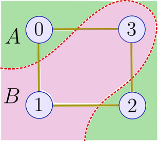
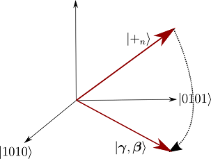

# Classical implementation of QAOA: special case of level-1 QAOA for MaxCut 

## The MaxCut problem

The aim of MaxCut is to maximize the number of edges in a graph that are “cut” by a given partition of the vertices into two sets (see figure below).

Consider a graph with <b>m</b> edges and ***n*** vertices. We seek the partition ***z*** of the vertices into two sets A and B which maximizes

%20=%20\sum_{\alpha%20=1}^{m}C_{\alpha}(z))

where ***C*** counts the number of edges cut. <b><i>C</i></b>&alpha;(***z***)=1 if ***z*** places one vertex from the
&alpha;th edge in set A and the other in set B, and ***C***&alpha;(***z***)=0 otherwise.
Finding a cut which yields the maximum possible value of ***_C_*** is an NP-complete problem, so our best hope for a
polynomial-time algorithm lies in an approximate optimization.
In the case of MaxCut, this means finding a partition ***z*** which
yields a value for ***C***(***z***) that is close to the maximum possible value.

We can represent the assignment of vertices to set A or B using a bitstring,
***z***=z1...zn where zi=0 if the ith vertex is in A and
zi = 1 if it is in B. For instance,
in the situation depicted in the figure above the bitstring representation is ***z***=0101,
indicating that the 0th and 2nd vertices are in A
while the 1st and 3rd are in
B. This assignment yields a value for the objective function
***C***=4, which turns out to be the maximum cut.

## QAOA for MaxCut

The Quantum Approximate Optimization Algorithm (QAOA) is a quantum algorithm which uses unitary evoltion of an intial state to find approximate solutions to a Constraints satisfaction problem (CSP). 
Firstly, denoting the partitions using computational basis states |***z***>, we can represent the terms in the
objective function as operators acting on these states

)

where the &alpha;th edge is between vertices (j,k).
***C***&alpha; has eigenvalue 1 if and only if the jth and kth
qubits have different z-axis measurement values, representing separate partitions.
The objective function ***C*** can be considered a diagonal operator with integer eigenvalues.

QAOA starts with a uniform superposition over the ***n*** bitstring basis states,

We aim to explore the space of bitstring states for a superposition which is likely to yield a
large value for the ***C*** operator upon performing a measurement in the computational basis.
Using the _2p_ angle parameters
,%20\boldsymbol{\beta}=(\beta_1,%20\beta_2,...,%20\beta_p))
we perform a sequence of operations on our initial state:

U(\gamma_p)...U(\beta_1)U(\gamma_1)|+_n\rangle)

where the operators have the explicit forms

}}%20e^{-i\gamma_l(1-\sigma_z^j\sigma_z^k)/2})

In other words, we make _p_ layers of parametrized ***UBUC*** gates.

Let **Fp** = <**&gamma;**,**&beta;**|***C***|**&gamma;**,**&beta;**> be the expectation of the objective operator.
The idea of the QAOA is to perform an optimization method  
over the circuit parameters (**&gamma;**,**&beta;**) to maximize **Fp**.
This will specify a state |**&gamma;**,**&beta;**> which is
likely to yield an approximately optimal partition |z> upon performing a measurement in the
computational basis.
In the case of the graph shown above, we want to measure either 0101 or 1010 from our state since these correspond to
the optimal partitions.

Qualitatively, QAOA tries to evolve the initial state into the plane of the
|0101>, |1010> basis states (see figure above).

For reference, see [here](https://arxiv.org/pdf/1411.4028.pdf) the first published article where the QAOA algorithm was introduced.

## Parameters Optimization

The general steps in QAOA for parameters optimizations are: 
  * choose QAOA-level = p and pick p-pairs parameters (&gamma;1,...,&gamma;p,&beta;1,...,&beta;p)0 
  * generate initial state |**s**> (usually is chosen to be easy to be prepeared) (which gives also $B$) 
  * evolve |**s**> in |**&gamma;**,**&beta;**> through 2p evolutions 
  * evaluate **Fp** (or only certain terms of it) through N-times computational basis measurement on |**&gamma;**,**&beta;**>, obtained as the "classical" meanvalue of the N-outcomes
  * update the parameters through a chosen method, for example the stochastic gradient descent      
* |**&gamma;**,**&beta;**> which optimize **Fp** will be obtained after these iterations (and the solutions to the problem could be seen from outcome probabilities of strings obtained in the computational basis measurement for these angles)

However, for QAOA-level = 1 on MaxCut, there's a theorem, which gives an analitical expression of the expectation of the cost function that has to be minimized, 
[here](https://arxiv.org/pdf/1706.02998.pdf) the paper with the theorem:

%20%20=%20\frac{1}{2}%20+%20\frac{1}{4}%20(sin4\beta%20sin2\gamma)(cos^{d_u}\gamma%20+%20cos^{d_v}\gamma)%20-%20\frac{1}{4}(sin^2\beta%20cos^{d_u%20+%20d_v%20-%202\lambda_{uv}}\gamma)) )

so, for each edge <u,v>, we have to get:
* du: degree of vertex u -1
* dv: degree of vertex v -1
* &lambda;uv: number common neighbours of vertices u and v

and in this special case the optimization steps are:

* get information of the graph
* parameter optimization:
    * evaluate analitical exspression of F1(&gamma;, &beta;) from graph informations
    * maximization of the function
* optimal (&gamma;, &beta;) will the ones that maximize F1

## Structure of the project

Here follws the steps required to start the program and to plot the results:

1. First, two packages has to be installed:
 * qutip
 * networkx  
that can be achieved by typying the command below in the working shell:
  
`python -m pip install -r requirements.txt`
 
2. Then, the user has to choose the graph for which this method finds the maximum cuts. In the file configurations.txt three are already defined, any graph can be added using the syntax of [configuration](https://github.com/andreabasiliorava/QAOA_MaxCut_1_level_classical_optimization/blob/master/configuration.txt), giving the number of nodes, the edges and also the local paths to the folders where drawing of the graph and the probability distribution of the possible configurations must be saved. 

3. To obtain the final state, which contains the informations about the MaxCut solutions, and their probability distribution, the user has to launch the file 
[execution](https://github.com/andreabasiliorava/QAOA_MaxCut_1_level_classical_optimization/blob/master/execution.py), which imports its parameters from [configuration](https://github.com/andreabasiliorava/QAOA_MaxCut_1_level_classical_optimization/blob/master/configuration.txt) using ConfigParser library. 
The user has to specify the graph he wants to obtain solution of when launching the simulation file from the command line with the syntax:
 
`python execution.py configuration.txt *graph_name*`

The obtained probability distributions are saved automatically in the ***prob_dist*** folder using their local paths.

4. To obtain the plots of the graph and it's respective histogram with the probability distributions of the final state with the maximum cuts be the more probable configurations, the user has to launch the [plots](https://github.com/andreabasiliorava/QAOA_MaxCut_1_level_classical_optimization/blob/master/plots.py) file with the graphs he wants. 
From command line the syntax is:
 
`python plots.py configuration.txt *graph_name*`

The data are loaded from the configuration file through their local paths and then they are saved in the ***plots*** folder automatically.

Here follows how I've structured this project:

* All the quantum objects are initialized through the Qobj() class defined in the ***qutip*** library, here the [qutip documentation](http://qutip.org/docs/latest/index.html), in the documentation there are also the required packages for running qutip. 
The graphs are initialized through the Graph() class defined in the ***networkx*** library, here the [networkx documentation](https://networkx.org/documentation/stable//index.html).
The file [requirements](https://github.com/andreabasiliorava/QAOA_MaxCut_1_level_classical_optimization/blob/master/requirements.txt) must be executed for the installation of these two packages.

* In the file [qucompsys](https://github.com/andreabasiliorava/QAOA_MaxCut_1_level_classical_optimization/blob/master/qucompsys.py) I've defined functions needed to operate with composite systems of multiple qubits (obtained through the *tensor()* function of qutip), three that operates the Pauli matrices &sigma;y, &sigma;y, &sigma;z on the *i*-th qubit of a n-qubits tensor and one that apply the identity. There's also a function that, given a quantum state, it returns an array containing the probability distribution of the computational basis vectors of the space it belongs to. A function that generates n-random qubits, used for testing proper behaviour of other defined functions.

* In the file [graphs](https://github.com/andreabasiliorava/QAOA_MaxCut_1_level_classical_optimization/blob/master/graphs.py) I've defined two functions needed to get information about a graph, one which returns the degree of a node and one which returns the number of common neighbours of an edge. Thre's also another function which generates a random graph, used for testing proper behaviour of other defined functions.

* In the file [qaoa](https://github.com/andreabasiliorava/QAOA_MaxCut_1_level_classical_optimization/blob/master/qaoa.py) I've defined all the function needed for the QAOA steps to obtain the final state |**&gamma;**,**&beta;**>, a function which evaluates the classical cost function given a configuration and the graph information, a function that evaluates the analitical expression of **F1** for a given pair of &gamma; and &beta; and a function which finds it's optimal angles via a grid search method. Also, it contains the functions needed to obtain the final state: one which initialize the intial state (it returns a quantum object obtained as the tensor product of the single qubit states |+>), two which define the mixing and problem Hamiltonians and another one which returns the evolution oprator U(**&gamma;**,**&beta;**), that has to be applyed to the intial state.

* In the file [testing](https://github.com/andreabasiliorava/QAOA_MaxCut_1_level_classical_optimization/blob/master/testing.py) I've tested all the qucompsys, graphs and qaoa functions to ensure that all of them work properly, using pytest testing, with the aid of hypothesis testing.

* In the file [configuration](https://github.com/andreabasiliorava/QAOA_MaxCut_1_level_classical_optimization/blob/master/configuration.txt) there are the definition of three graphs (butterfly, square and house graphs). Furthermore, there are the local paths in order to load the array data and to save them as images and graphs. It's a .txt file that is imported in execution file.

* In the file [execution](https://github.com/andreabasiliorava/QAOA_MaxCut_1_level_classical_optimization/blob/master/execution.py) there is the main part of the code, where the steps of the 1-level QAOA for MAxCut are performed using functions defined in the qaoa, qucompsys and graphs files. First is defined the graph, then the optimal parameters are obtain through a grid search method and, after have intialized the initial state, the final state is obtained by applying the evolution operator to the intial state with the optimal parameters obtained in the grid search step. The probability distribution of the configurations contained in the final state are saved in a file. Here I used the ConfigParser library in order to import the configuration file from command line, and passing its parameters to the program. 

* In the file [plots](https://github.com/andreabasiliorava/QAOA_MaxCut_1_level_classical_optimization/blob/master/plots.py) there are two functions that respectively plot the graph and the probability distributions of all the possible configurations of a cut applyed to the graph, loading the data of the graph from command line.

### Examples of results for the square graph used as the introductory example:

and it can be seen that the most probable configuration is the one corresponding to the maximum cut of the graph.
